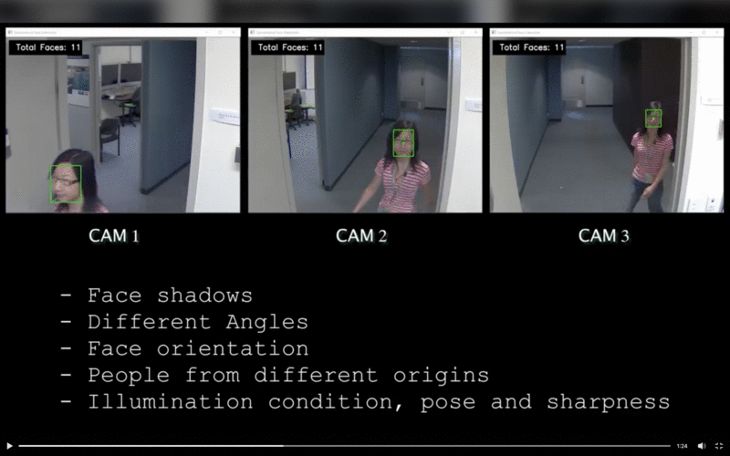

# 👤 Advance Face Tracking
<Project by a Private Company>

### Detect, count, and track a vast range of faces seamlessly using a 3-camera setup, streaming in real-time with unparalleled accuracy! 🌟

### Features
📹 Triple Camera Setup: Utilizes three cameras for comprehensive coverage.
🕵️ Advanced Face Detection: Recognizes a wide range of faces accurately.
📊 Real-time Streaming: Provides instant face tracking results.
🔢 Face Counting: Know the exact number of faces detected at any given moment.

### 🎥 GIF Demo

### Modern Applications of Advanced Face Tracking Systems 🌍

1. **Smart Retail & Personalized Shopping 🛍️**: 
   - Elevate the shopping experience by recognizing loyal customers and tailoring in-store advertisements and promotions to their preferences.
   - Manage store traffic efficiently by monitoring crowd density.

2. **Advanced Security & Surveillance 🎥**:
   - Enhance security in public spaces, airports, and critical infrastructure by identifying suspicious activities or blacklisted individuals in real time.
   - Reduce the need for manual monitoring with automated alerts.

3. **Health & Safety Compliance 🌡️**:
   - Monitor public spaces or work environments for compliance with health regulations, such as mask-wearing during pandemics.
   - Ensure capacity limitations in venues are adhered to, promoting safe distancing practices.

4. **Augmented Reality (AR) & Virtual Reality (VR) Gaming 🎮**:
   - Enhance user experience by adapting virtual elements based on facial expressions and orientation.
   - Provide immersive character controls through face movements.

5. **Automotive & Driver Monitoring 🚗**:
   - Enhance vehicular safety by monitoring driver attentiveness, detecting signs of fatigue, and issuing real-time alerts.
   - Personalize vehicle settings by recognizing the driver upon entry.

6. **Interactive Marketing & Advertisements 🖥️**:
   - Curate dynamic billboards and public advertisements that change based on viewer demographics and reactions.
   - Gain valuable insights into audience engagement for effective ad placement.

7. **Smart Home Integration 🏡**:
   - Personalize room settings, such as lighting or music, based on the resident's facial recognition.
   - Enhance home security with entry permissions based on face recognition.

8. **Event & Venue Management 🎤**:
   - Facilitate swift entry during events by using face recognition as an e-ticket.
   - Gather data on audience engagement and demographics during performances or exhibitions.

---

Face tracking systems are reshaping the way we interact with our environments, adding a layer of personalization, efficiency, and security to a plethora of sectors. As technology evolves, we can only anticipate even more groundbreaking applications in the horizon.

Connect with Me
Feel free to reach out or check out my other projects:
[LinkedIn Demo](https://www.linkedin.com/feed/update/urn:li:activity:6753555787525844992/)

